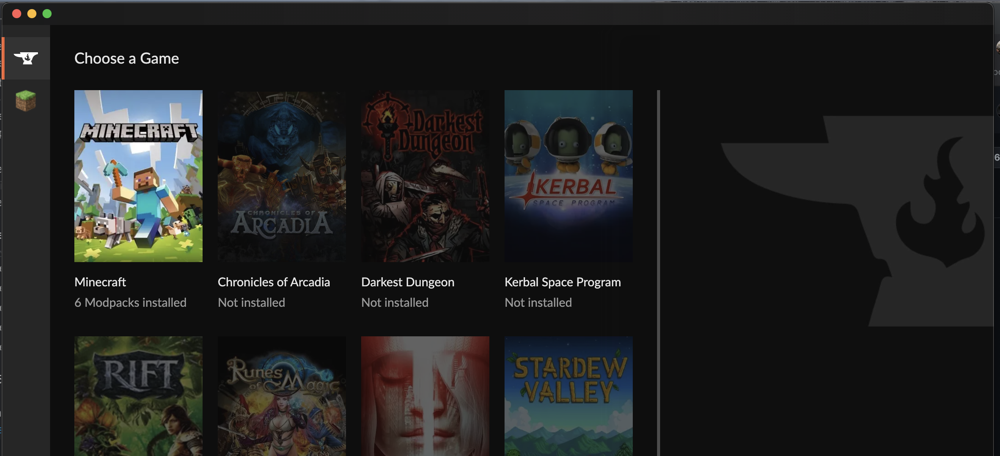
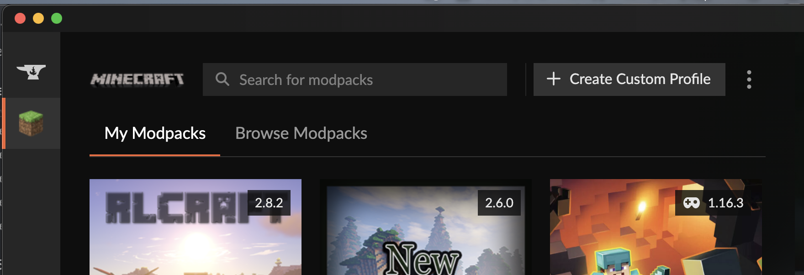
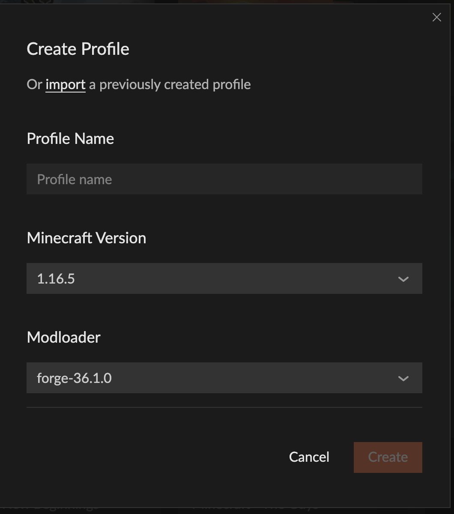
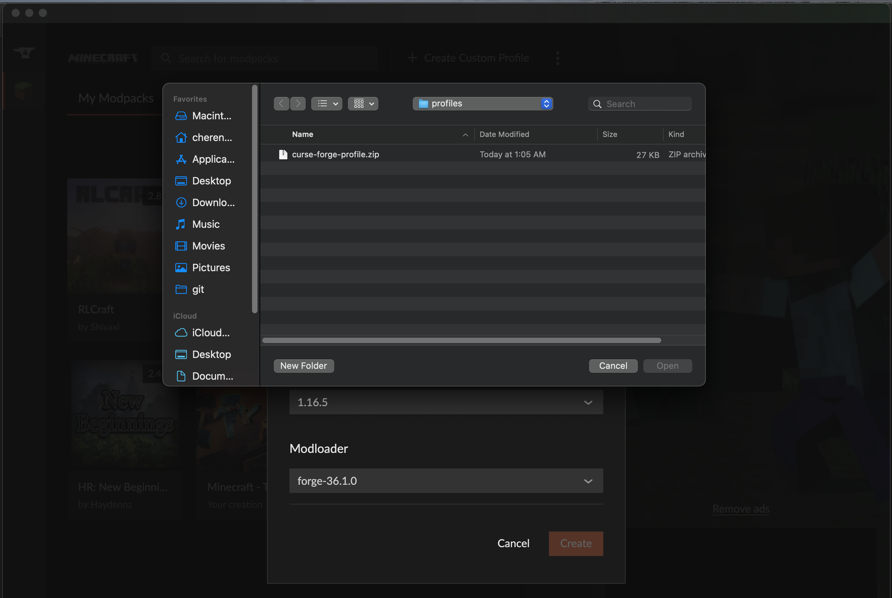
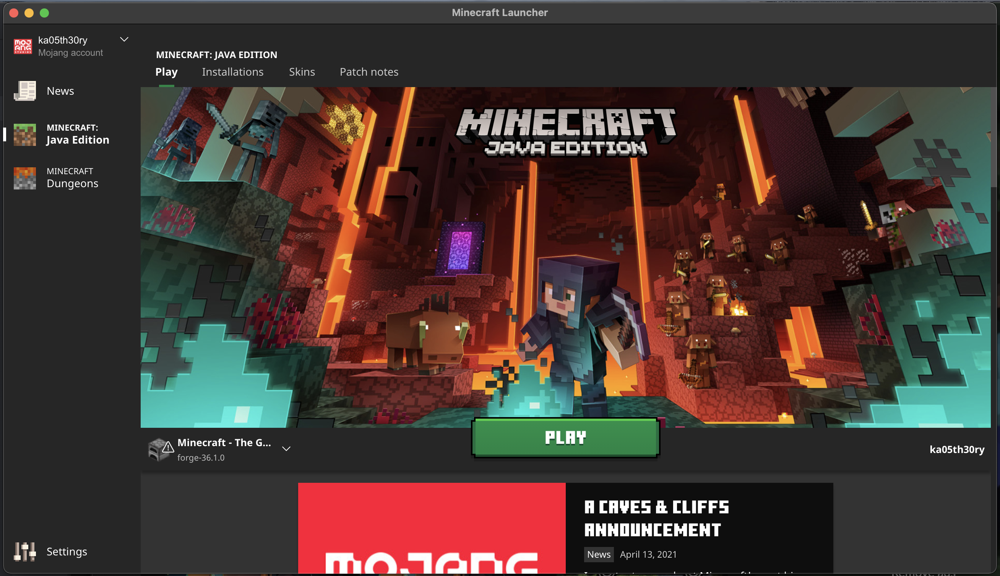
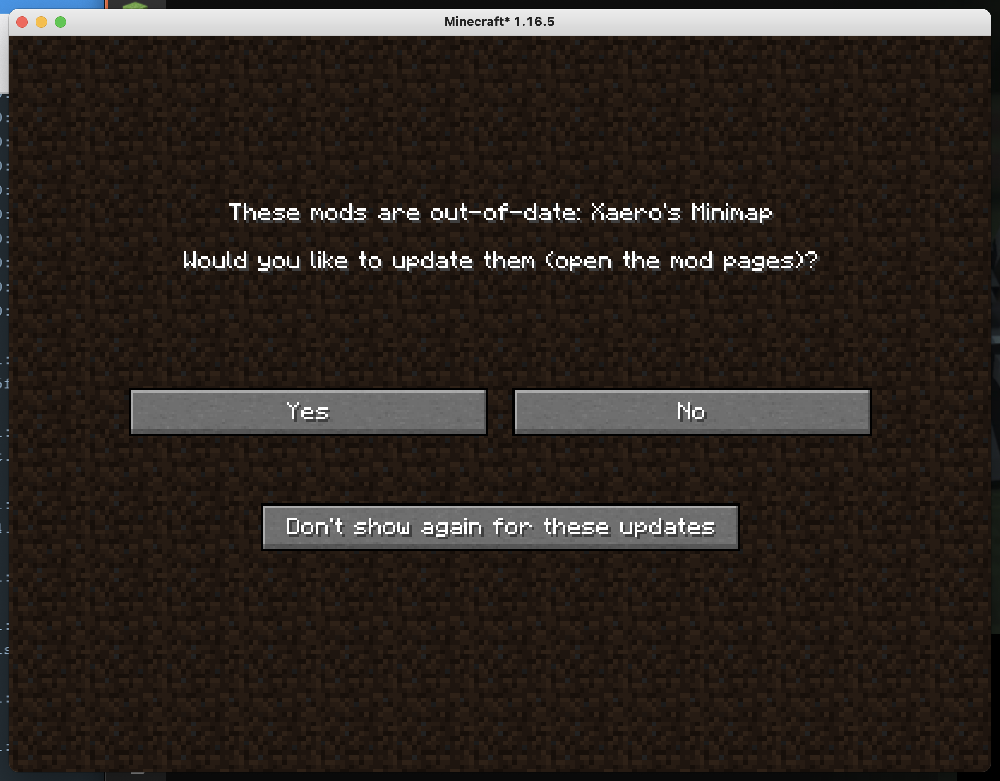

# Minecraft Client Setup Guide

1. First download the [CurseForge Launcher](https://curseforge.overwolf.com/)

2. Download CurseForge Profile [curse-forge-profile.zip](./../profiles/curse-forge-profile.zip)

3. Click "+ Create Custom Profile" button

4. Click "Import" button/link

5. Select the downloaded zip file "curse-forge-profile.zip"

6. You should see a new item under "My Modpacks" called "Minecraft - The Guys". Wait for mods to download then hit play. This will launch the Minecraft Launcher. Login if you haven't yet and then hit "Play" and connect to the server IP.

7. If you run into this warning when launching the game, just select "No".